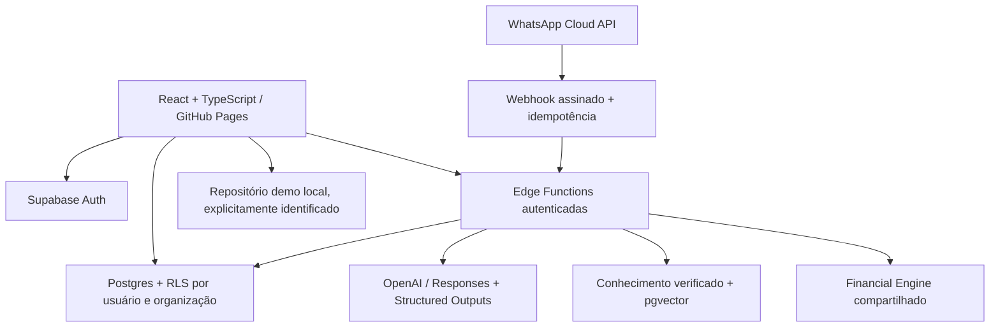

# Arquitetura do Nexo

Nexo conecta registro financeiro, decisão e próximo passo. O motor calcula em centavos; a IA interpreta resultados e recupera evidências, sem autoridade para alterar valores ou executar operações arbitrárias.

## Limites de domínio

- `shared/`: dinheiro, datas, validação, projeções, score e contratos; executa no navegador e no Deno.
- `src/design-system/`: tokens e componentes acessíveis reutilizáveis.
- `src/data/`: repositórios demo/Supabase, autenticação, consultas e invalidação.
- `src/features/`: pessoal, empresas, assistente, privacidade e autenticação.
- `supabase/migrations/`: schema, constraints, RLS, RPCs atômicos e auditoria.
- `supabase/functions/`: APIs de IA, RAG, WhatsApp e direitos do titular.
- `tests/`: unitários financeiros, integração SQL e navegação Playwright.
- `scripts/`: ingestão de resumos autorais com referências e embeddings.
- `docs/`: benchmark, roadmap, critérios e evidência de validação.

## Decisões

HashRouter evita 404 de rotas no Pages. TanStack Query controla dados remotos. Demo usa armazenamento local com namespace exclusivo; contas reais usam exclusivamente Supabase e nunca herdam dados demo. Valores persistidos são inteiros seguros de centavos, com multiplicação e arredondamento via BigInt. Taxas em pontos-base (100 = 1%). Datas civis ISO são separadas de instantes UTC; o timezone é explícito.

Postgres é a autoridade de autorização. Organização não é apenas um filtro de interface: toda leitura e alteração exige associação e papel. RLS também protege recursos associados por chaves estrangeiras compostas. Segredos permanecem nas Functions. RAG é conteúdo não confiável e só fornece evidências; respostas não possuem ferramentas de escrita.

## Dependências e riscos

Supabase e Meta dependem de projetos e credenciais do proprietário. A API OpenAI exige faturamento e acesso aos modelos configurados. Entrega de WhatsApp depende da aprovação do aplicativo/número e das regras vigentes da Meta. A execução local sem esses serviços não comprova integrações em produção.

Score é uma heurística de planejamento documentada, não avaliação de crédito nem escala clínica validada. Projeções não garantem retorno. Encargos trabalhistas e inflação são premissas editáveis. Operação comercial requer revisão jurídica, auditoria independente, testes de restauração, política de retenção e monitoramento operacional.
