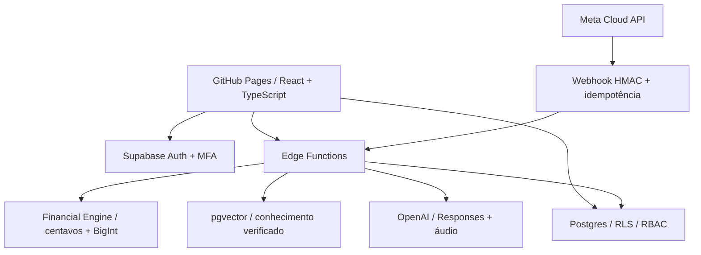

# Nexo

**Seu dinheiro precisa levar você a algum lugar.**

Plataforma de planejamento financeiro pessoal e empresarial: entender o momento, encontrar o próximo marco e decidir com números explicáveis.


## Executar agora

Requisito: Node.js 24 LTS e npm. A demonstração funciona sem cadastro, Supabase ou chave de IA.

```sh
npm install
npm run dev
```

Abra `http://localhost:5173` e escolha **Explorar demonstração**. Dados fictícios e alterações ficam neste navegador. No PowerShell com restrição a scripts, use `npm.cmd` e `npx.cmd`, sem mudar a política de execução do Windows.

## Implementado

- Interface responsiva em português, tokens, teclado, foco, dialogs e reduced motion.
- Demonstração pessoal/empresarial; repositórios separados para localStorage e Supabase.
- Cadastro/login, recuperação, onboarding e MFA TOTP exigido também em RLS.
- Movimentos, contas/cartões, bens, dívidas, orçamentos, metas e equipe com persistência.
- Jornada contextual, score explicável, reserva adaptativa, plano semanal e relatórios.
- Simuladores de compra, juros, inflação, quitação de dívidas e contratação.
- Empresas isoladas, workspaces, papéis, DRE gerencial estimada e auditoria.
- Backend OpenAI com Responses, Structured Outputs, validação e transcrição.
- RAG com pgvector, fontes verificadas e resposta explícita quando faltam evidências.
- WhatsApp com HMAC, vínculo temporário, texto/áudio, confirmação, parcelas e desfazer; gravação idempotente.
- Privacidade: exportação, exclusão de histórico/conta, revogação de vínculo e sessões.
- CI de qualidade e publicação manual no GitHub Pages.

**Versão inicial executável; não é uma homologação de produção de todos os 77 itens.** A [matriz de entrega](docs/STATUS.md) distingue implementação, testes, dependências e funcionalidades pendentes. Integrações externas precisam de credenciais e validação ponta a ponta. A demonstração não finge chamadas reais nem mostra fontes inventadas.

## Produto e arquitetura

O núcleo é **dados → cálculo determinístico → evidência → explicação**. O [benchmark](docs/BENCHMARK.md) registra fontes e limitações: IA, PF/PJ e Open Finance já aparecem em outros produtos; não afirmamos exclusividade.



O navegador recebe somente URL e chave pública do Supabase. Secrets permanecem no servidor. O motor é compartilhado entre frontend e Functions; o LLM não define valores monetários calculados.

## Stack e comandos

React, TypeScript estrito, Vite, React Router, TanStack Query, Zod, Supabase JS, Recharts e Lucide. CSS com tokens próprios e formulários controlados com validação Zod. Vitest, Playwright, axe e PostgreSQL via PGlite verificam comportamento, matemática e autorização. Deno verifica as Functions.

| Comando                             | Finalidade                              |
| ----------------------------------- | --------------------------------------- |
| `npm run dev`                       | Servidor local                          |
| `npm run check`                     | Lint, TypeScript, testes e build        |
| `npm run test:coverage`             | Cobertura financeira                    |
| `npm run typecheck:edge`            | TypeScript das Functions                |
| `npm run test:edge`                 | Segurança do backend, sem rede          |
| `npx playwright install chromium`   | Navegador de testes                     |
| `npm run test:e2e`                  | Desktop/mobile e axe                    |
| `npm run rag:check`                 | Valida seed sem serviços                |
| `npm run rag:seed`                  | Indexa conhecimento; consome embeddings |
| `npm run build` / `npm run preview` | Gera e inspeciona frontend estático     |

O Nexo Score é uma heurística educacional, não score de crédito ou escala validada. Projeções não garantem retorno. Encargos são editáveis; DRE é gerencial, não contábil. Operação comercial requer revisão jurídica e financeira independente.

Fontes técnicas: [Structured Outputs](https://developers.openai.com/api/docs/guides/structured-outputs), [modelos OpenAI](https://developers.openai.com/api/docs/models), [RLS](https://supabase.com/docs/guides/database/postgres/row-level-security), [MFA](https://supabase.com/docs/guides/auth/auth-mfa/totp).

## Documentação

[Arquitetura](ARCHITECTURE.md) · [Banco](DATABASE.md) · [Motor](FINANCIAL_ENGINE.md) · [Design](DESIGN_SYSTEM.md) · [RAG](RAG.md) · [WhatsApp](WHATSAPP.md) · [Segurança](SECURITY.md) · [Privacidade](PRIVACY.md) · [Contribuição](CONTRIBUTING.md) · [Roadmap](docs/ROADMAP.md) · [Árvore](docs/PROJECT_TREE.md)

## RUAN, PARA COLOCAR O NEXO NO AR, FAÇA ISSO.

1. Rode `npm install` e `npm run dev` para conferir a demonstração.
2. Crie um projeto Supabase e preencha `.env` a partir do exemplo com URL e chave publishable.
3. Aplique todas as migrations em ordem e publique as Edge Functions.
4. Preencha `.env.server`, prepare os secrets e configure OpenAI/Meta no servidor.
5. Rode `npm run rag:seed` para indexar os resumos revisados.
6. Configure o webhook Meta e vincule sua conta pelo app.
7. Cadastre as duas variáveis públicas no GitHub, selecione Pages → GitHub Actions e execute **Publish GitHub Pages**.
8. Homologue cadastro, e-mail, isolamento, MFA, IA, fontes, WhatsApp e exclusão antes de usar dados reais.

O [guia de publicação](DEPLOYMENT.md) contém os comandos exatos e onde obter cada chave. Nada foi publicado automaticamente.
