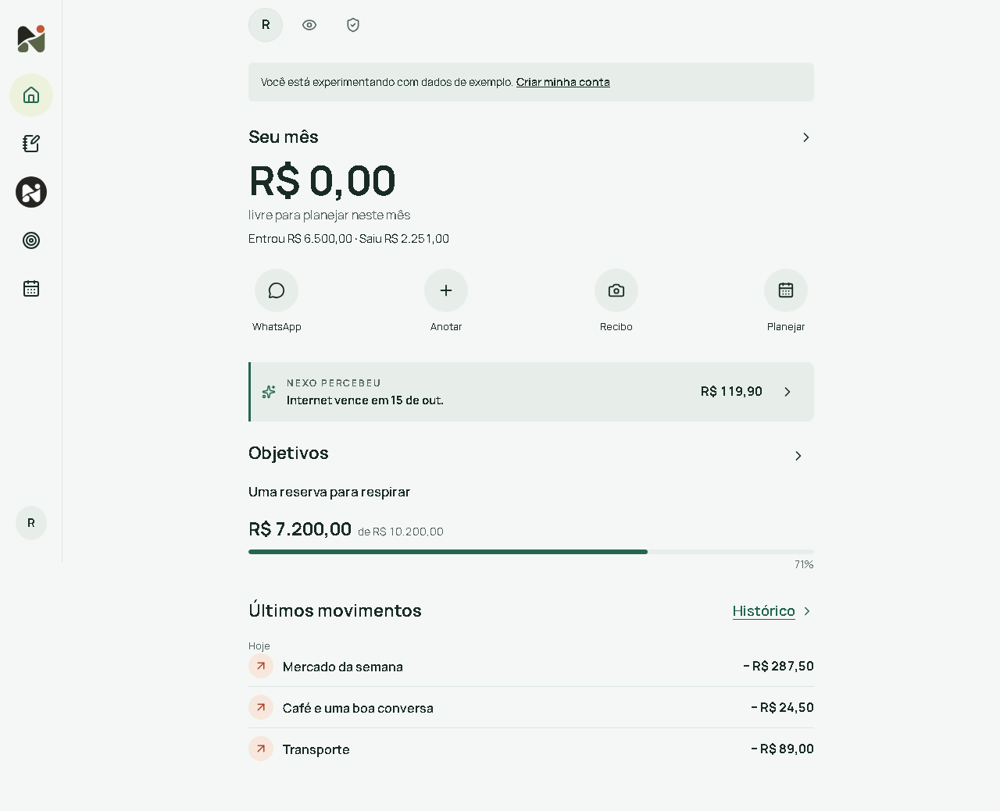
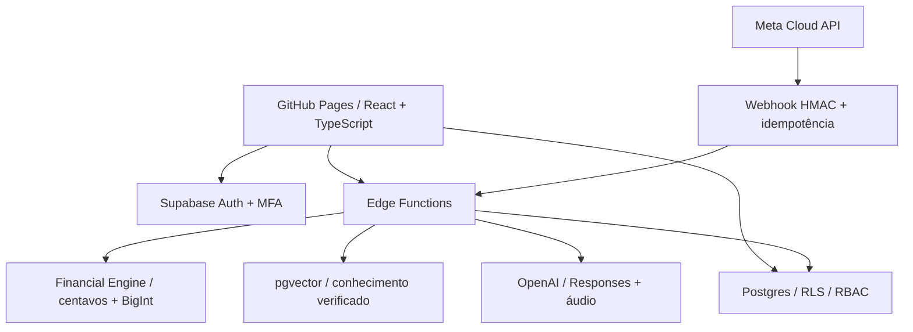

# Nexo

**Seu dinheiro, sem complicação.**

Aplicativo de finanças pessoais pensado para pessoas com pouca familiaridade com tecnologia, incluindo idosos. WhatsApp para anotar por texto ou áudio; app para conferir o mês e corrigir anotações.



## Executar agora

Requisito: Node.js 24 LTS e npm. A demonstração funciona sem cadastro, Supabase ou chave de IA.

```sh
npm install
npm run dev
```

Abra `http://localhost:5173` e escolha **Experimentar sem cadastro**. Dados fictícios e alterações ficam neste navegador. No PowerShell com restrição a scripts, use `npm.cmd` e `npx.cmd`, sem mudar a política de execução do Windows.

## Implementado

- Quatro destinos: Início, Anotações, WhatsApp e Ajustes; textos grandes, ações escritas e modo noturno.
- Resumo mensal de entradas, gastos e diferença; não representa saldo bancário. Previsões e datas futuras não entram no resumo até acontecerem.
- Anotação manual com valor, descrição e data; detalhes opcionais. Correção preserva origem, categoria e conta de registros anteriores.
- WhatsApp com mensagem pronta para conexão, confirmação, texto/áudio, “resumo”, “ajuda” e “desfazer”; gravação idempotente.
- Cadastro inicial pede só nome. Login/recuperação, MFA existente e isolamento RLS preservados.
- Privacidade: exportação, exclusão de conta e desconexão do WhatsApp.
- Demonstração local e persistência real em Supabase, com atualização após mensagens recebidas.
- CI de qualidade e publicação manual no GitHub Pages.
- Planejamento: contas mensais pendentes, limites por categoria e metas; avisos e resumo semanal no app com consentimento desativado por padrão.
- Perguntas verificáveis no app e WhatsApp: comparação entre períodos, falta para metas e contas pendentes, com cálculo e registros de origem.
- CSV/OFX: seleção de conta, mapeamento de colunas, revisão, identificação de duplicatas e importação atômica. Não é Open Finance.
- Família: convite com expiração, pedido de acesso, aprovação do dono, escopo de resumo ou últimas 100 anotações, somente consulta e revogação.
- Worker de avisos WhatsApp preparado, mas exige publicação, credencial de job, template Meta aprovado e agendamento. Não é ativado automaticamente.
- Decidir: dinheiro confirmado no dia, contas/reservas/metas protegidas e renda prevista não antecipada; premissas e registros ficam visíveis.
- Mais controle: sugestões de assinaturas/cobranças incomuns, ciclos de cartões, preferências futuras de categoria, histórico com restauração condicionada à versão atual e métricas técnicas opt-in.
- Recorrências de renda/despesa semanal, mensal e anual, com término e reajuste. Importação revisada até 10.000 registros, páginas de 50, erros por linha e conciliação explícita entre fontes.
- Família por conta/período e propostas de correção: o dono aprova e conflitos bloqueiam alteração; nunca há edição direta pelo familiar.
- Offline opt-in neste aparelho: cache/fila cifrados por usuário e inserção idempotente ao reconectar. O service worker guarda só arquivos públicos do app; sair ou desativar remove dados locais.
- Fotos de recibos geram prévia pendente, nunca confirmação automática de pagamento; requer `OPENAI_VISION_MODEL` e revisão do usuário.
- Estado dos vinte itens, limitações e evidências em `docs/next-release-status.json`. Não há estudo comparativo realizado nem integração Open Finance homologada.

**Escopo simplificado em outubro de 2026.** Empresa, score e simuladores saíram da navegação e das rotas públicas. Planejamento, perguntas e importação ficam em áreas secundárias, preservando os quatro destinos principais. Dados antigos e migrações foram preservados, sem exclusão de registros. Documentos de planejamento anteriores podem descrever o escopo original. O WhatsApp usa o status real das entregas para informar falhas, sem avisos fixos de bloqueio.

## Produto e arquitetura

O núcleo é **dados → cálculo determinístico → evidência → explicação**. O [benchmark](docs/BENCHMARK.md) registra fontes e limitações: IA, PF/PJ e Open Finance já aparecem em outros produtos; não afirmamos exclusividade.



O navegador recebe somente URL e chave pública do Supabase. Secrets permanecem no servidor. O motor é compartilhado entre frontend e Functions; o LLM não define valores monetários calculados.

## Stack e comandos

React, TypeScript estrito, Vite, React Router, TanStack Query, Zod, Supabase JS, Recharts e Lucide. CSS com tokens próprios e formulários controlados com validação Zod. Vitest, Playwright, axe e PostgreSQL via PGlite verificam comportamento, matemática e autorização. Deno verifica as Functions.

| Comando                             | Finalidade                              |
| ----------------------------------- | --------------------------------------- |
| `npm run dev`                       | Servidor local                          |
| `npm run check`                     | Lint, TypeScript, testes e build        |
| `npm run test:coverage`             | Cobertura financeira                    |
| `npm run typecheck:edge`            | TypeScript das Functions                |
| `npm run test:edge`                 | Segurança do backend, sem rede          |
| `npx playwright install chromium`   | Navegador de testes                     |
| `npm run test:e2e`                  | Desktop/mobile e axe                    |
| `npm run rag:check`                 | Valida seed sem serviços                |
| `npm run rag:seed`                  | Indexa conhecimento; consome embeddings |
| `npm run build` / `npm run preview` | Gera e inspeciona frontend estático     |

O Nexo Score é uma heurística educacional, não score de crédito ou escala validada. Projeções não garantem retorno. Encargos são editáveis; DRE é gerencial, não contábil. Operação comercial requer revisão jurídica e financeira independente.

Fontes técnicas: [Structured Outputs](https://developers.openai.com/api/docs/guides/structured-outputs), [modelos OpenAI](https://developers.openai.com/api/docs/models), [RLS](https://supabase.com/docs/guides/database/postgres/row-level-security), [MFA](https://supabase.com/docs/guides/auth/auth-mfa/totp).

## Documentação

[Arquitetura](ARCHITECTURE.md) · [Banco](DATABASE.md) · [Motor](FINANCIAL_ENGINE.md) · [Design](DESIGN_SYSTEM.md) · [RAG](RAG.md) · [WhatsApp](WHATSAPP.md) · [Segurança](SECURITY.md) · [Privacidade](PRIVACY.md) · [Contribuição](CONTRIBUTING.md) · [Roadmap](docs/ROADMAP.md) · [Árvore](docs/PROJECT_TREE.md)

## RUAN, PARA COLOCAR O NEXO NO AR, FAÇA ISSO.

1. Rode `npm install` e `npm run dev` para conferir a demonstração.
2. Crie um projeto Supabase e preencha `.env` a partir do exemplo com URL e chave publishable.
3. Aplique todas as migrations em ordem e publique as Edge Functions.
4. Preencha `.env.server`, prepare os secrets e configure OpenAI/Meta no servidor.
5. Rode `npm run rag:seed` para indexar os resumos revisados.
6. Configure o webhook Meta e vincule sua conta pelo app.
7. Cadastre as duas variáveis públicas no GitHub, selecione Pages → GitHub Actions e execute **Publish GitHub Pages**.
8. Homologue cadastro, e-mail, isolamento, MFA, IA, fontes, WhatsApp e exclusão antes de usar dados reais.

O [guia de publicação](DEPLOYMENT.md) contém os comandos de instalação em outro ambiente. Instância do projeto: https://ruan-crdz.github.io/nexo/.
